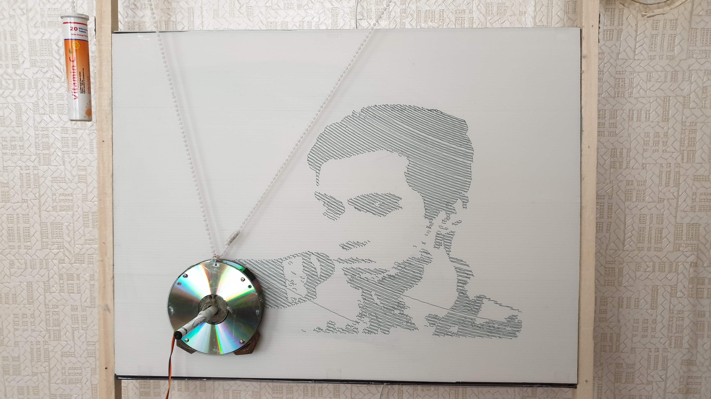
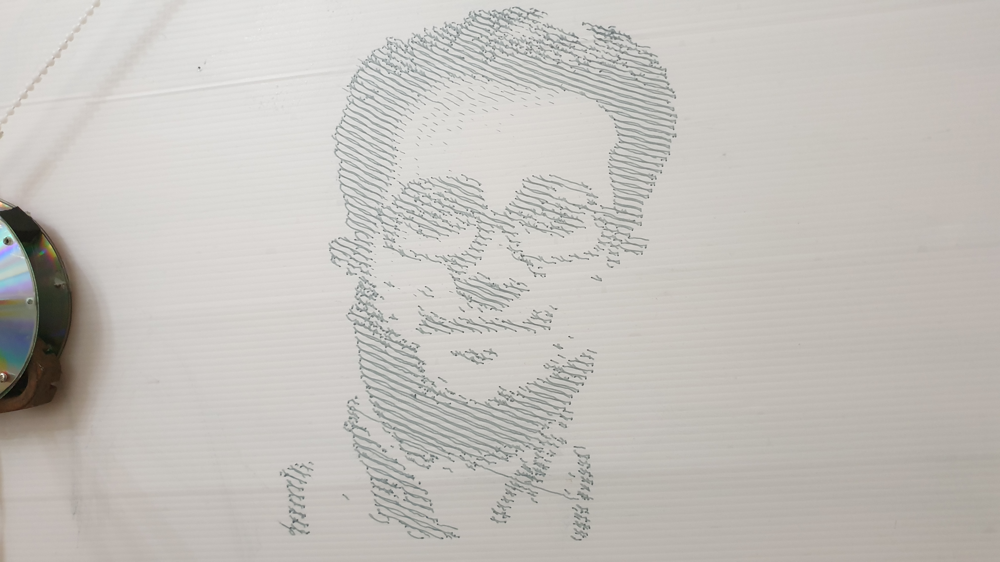
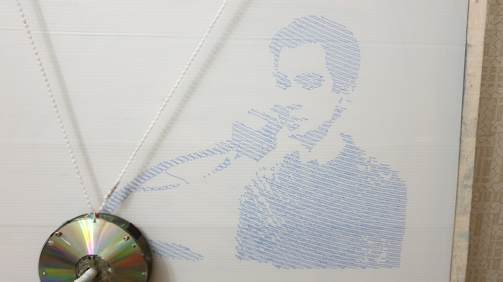
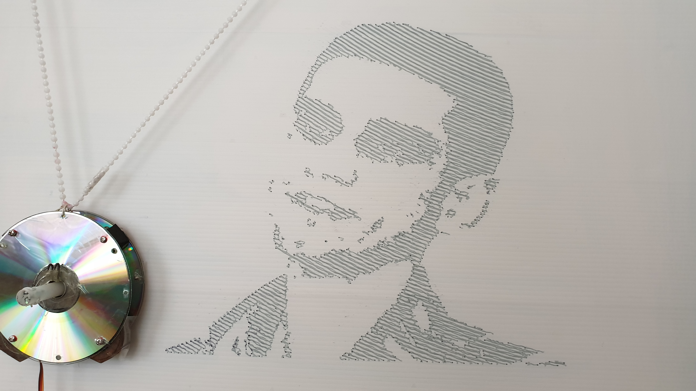

#  Vertical Plotter

This repo contains my Bachelor's thesis titled **Vertical Plotter**. It's a cable robot with two cables that can draw images on vertical surfaces. It was built with two simple strings, a pointer. Raspberry Pi was used for the hardware part and the image processing was done with Python and OpenCV.

##  Results

